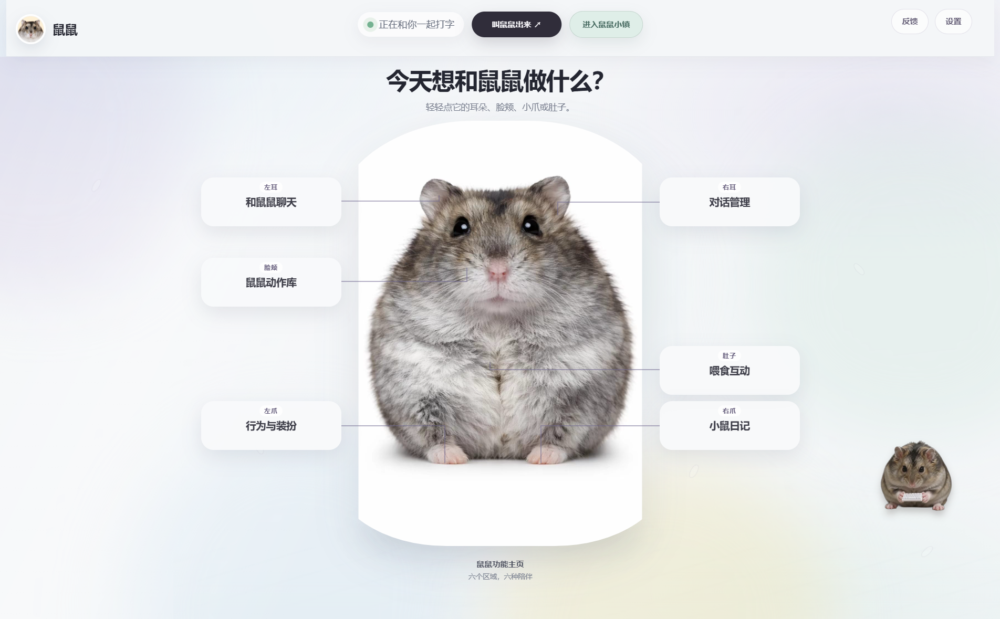

# 鼠鼠桌面小宠

一只会在 Windows 桌面陪伴你的小仓鼠。它能回应点击和键盘输入，在 3D、真实动态与 AI 漫剧三种形态之间切换，还能跑跑轮、接受投喂、换装、说话，并记录每日互动日记。

A Windows desktop hamster companion with interactive 3D, real-motion, and AI Drama forms, feeding, outfits, dialogue, a running wheel, and daily journals.

## 主页展示 / Home Preview



## 功能

- 透明桌面小宠窗口与系统托盘
- 点击、键盘输入和闲置状态反馈
- 真实动态动作库与自定义动作导入
- 可在可旋转的 CC0 3D 模型、真实动态和 AI 漫剧三种形态间切换
- AI 漫剧形态包含待机呼吸、蹦跳、睡眠、侧躺、开心和爬行六套透明动画
- 菜叶、面包虫、小饼干、营养糊糊投喂互动
- 跑轮、装扮、自定义对话和开心叫声
- 每日互动统计和小鼠日记
- 大小调节、位置拖动与开机后的快捷启动

## AI Drama Form / AI 漫剧形态

The AI Drama form includes six transparent animations: idle breathing, hopping, sleeping, lying down, happiness, and crawling. Only the final runtime WebP files and manifest are published; source photos, frame projects, generation sheets, and test captures remain private.

AI 漫剧形态包含待机呼吸、蹦跳、睡眠、侧躺、开心和爬行六套透明动画。公开仓库只提供运行所需的最终 WebP 与动作清单，原始照片、逐帧工程、生成母版和测试截图不会公开。

## 快速开始

需要 Windows 10/11、Node.js 20 或更高版本，以及 pnpm。

```bash
pnpm install
pnpm start
```

生成 Windows 安装包：

```bash
pnpm dist
```

## 自定义鼠鼠

在“鼠鼠动作库”中可以导入透明背景的 WebP、GIF、APNG 或 PNG。为了获得自然效果，建议使用已经抠好主体、动作长度为 3 至 8 秒的素材。

仓库包含由如月十二制作、以 CC0 发布的“ハムちゃん/Hamster”3D模型。来源与许可说明见 [MODEL_SETUP.md](MODEL_SETUP.md)。

## 开源与素材

程序代码使用 MIT License。仓库内的鼠鼠影像、声音和食物素材不属于 MIT 软件许可证；随仓库提供的仓鼠3D模型使用 CC0，具体见 [ASSETS_LICENSE.md](ASSETS_LICENSE.md)。

## 参与贡献

欢迎提交 Issue、功能建议和 Pull Request。请先阅读 [CONTRIBUTING.md](CONTRIBUTING.md)。
